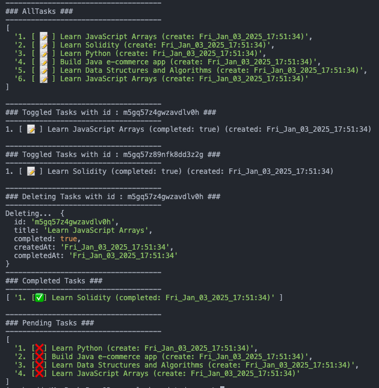

# Console-Based Todo List

## Result

## Project Description
A JavaScript console-based todo list application that demonstrates understanding of arrays, objects, loops, and basic algorithms. The application allows users to manage tasks through the browser's console interface.

## Learning Objectives
- Working with arrays and array methods
- Understanding objects and their properties
- Implementing loops for data manipulation
- Basic CRUD operations (Create, Read, Update, Delete)
- Using JavaScript built-in functions

## Features
- Add new tasks
- View all tasks
- Mark tasks as complete
- Delete tasks
- List tasks by status (complete/incomplete)

## Core Data Structure
```javascript
// Example task object structure
const task = {
    id: 1,
    title: "Learn JavaScript",
    completed: false,
    createdAt: "2025-01-03",
    completedAt: null
}

// Tasks array
let tasks = [];
```

## Required Functions

### 1. Task Management
```javascript
addTask(title)         // Adds a new task
deleteTask(id)         // Removes a task by ID
toggleComplete(id)     // Toggles task completion status
```

### 2. Task Display
```javascript
listAllTasks()         // Shows all tasks
listCompletedTasks()   // Shows completed tasks
listPendingTasks()     // Shows incomplete tasks
```

## Usage Examples
```javascript
// Adding a task
addTask("Learn JavaScript Arrays");

// Viewing tasks
listAllTasks();
// Output:
// 1. [ ] Learn JavaScript Arrays (Created: 2025-01-03)

// Marking as complete
toggleComplete(1);
// Output:
// Task "Learn JavaScript Arrays" marked as complete

// Listing completed tasks
listCompletedTasks();
// Output:
// 1. [✓] Learn JavaScript Arrays (Completed: 2025-01-03)
```

## Implementation Steps

1. Set up the data structure
   - Create the tasks array
   - Define the task object structure

2. Implement core functions
   - Write the add task functionality
   - Create the delete task method
   - Implement the toggle complete function

3. Add display functions
   - Create list all tasks function
   - Implement filtered views (complete/incomplete)

4. Add helper functions
   - Generate unique IDs
   - Format dates
   - Validate inputs

## Testing Scenarios

Test your application with these scenarios:
1. Add multiple tasks
2. Delete existing tasks
3. Try to delete non-existent tasks
4. Mark tasks as complete/incomplete
5. View different task lists
6. Handle empty lists

## Bonus Challenges

1. Add task priority levels
2. Implement task categories
3. Add due dates
4. Sort tasks by different criteria
5. Add task search functionality

## Console Testing Commands
```javascript
// Test sequence
addTask("Learn JavaScript");
addTask("Practice Arrays");
listAllTasks();
toggleComplete(1);
listCompletedTasks();
deleteTask(2);
listAllTasks();
```

## Expected Output Format
```
All Tasks:
1. [ ] Learn JavaScript (Created: 2025-01-03)
2. [ ] Practice Arrays (Created: 2025-01-03)

Completed Tasks:
1. [✓] Learn JavaScript (Completed: 2025-01-03)

Updated Task List:
1. [✓] Learn JavaScript (Completed: 2025-01-03)
```

## Tips for Implementation
1. Use descriptive variable names
2. Comment your code
3. Handle edge cases
4. Use modern JavaScript features (ES6+)
5. Consider data persistence (could be added later)
6. Implement error handling
