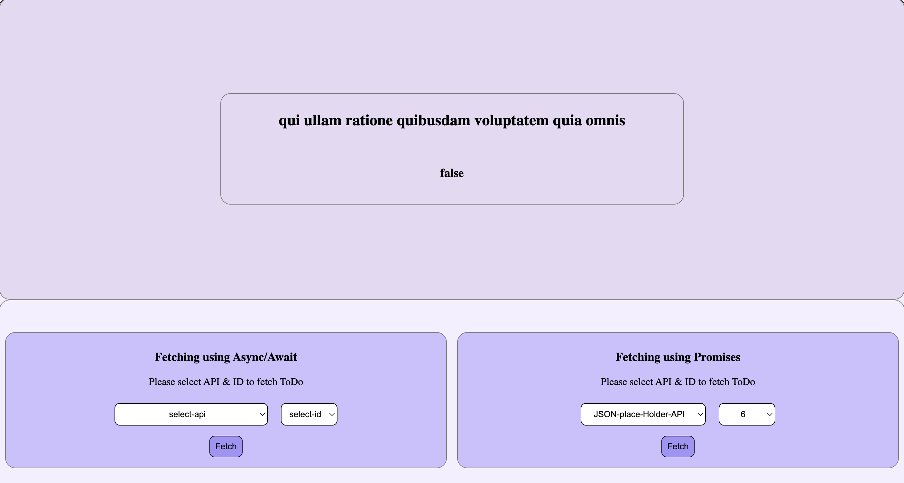

# API Fetcher Project

## Result

## Recommended APIs for Practice
1. JSONPlaceholder (https://jsonplaceholder.typicode.com)

## Project Steps

### Phase 1: Project Setup
1. **Create project folder structure**
   - Main project folder
   - Separate folders for CSS and JavaScript
   - Create necessary files: HTML, CSS, and JS files

2. **Set up basic HTML structure**
   - Create a form or input area
   - Add a results display section
   - Include a loading indicator

### Phase 2: Basic Functionality
1. **Create the user interface**
   - Add dropdown menu for API endpoint selection
   - Create a fetch button
   - Design the results display area

2. **Implement basic JavaScript structure**
   - Set up event listeners
   - Create functions for handling user interactions

### Phase 3: API Integration
1. **Create API handling functionality**
   - Set up fetch requests
   - Implement Promise handling
   - Add async/await functionality

2. **Add data processing**
   - Parse API responses
   - Format data for display
   - Handle different data types

### Phase 4: User Experience
1. **Add loading states**
   - Show loading indicator while fetching
   - Disable buttons during fetch

2. **Enhance data presentation**
   - Format the displayed data nicely
   - Add sorting options or filters

### Phase 5: Enhancement Features
1. **Additional features**
   - Add pagination
   - Implement data caching
   - Add multiple API endpoint support

## Learning Focus Points
1. **Promise Concepts**
   - Promise creation and chaining
   - Promise.all usage

2. **Async/Await**
   - Async function syntax
   - Proper await usage

3. **API Interaction**
   - Making API requests
   - Handling responses

## Success Criteria
- Successfully fetch data from at least two different API endpoints.
- Present data in a clean, organized way.
- Use both Promises and async/await syntax.
- Have a user-friendly interface.
